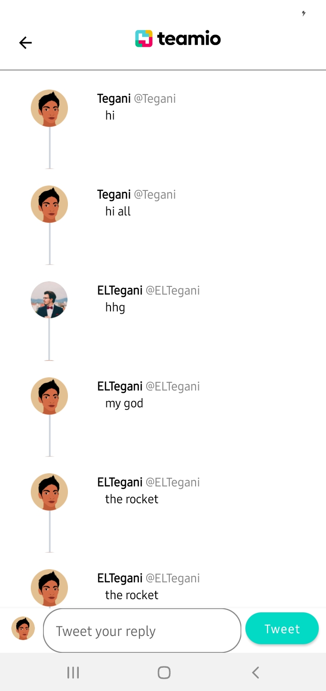

# twitter-clone

## Screenshots

<table align="center">
        <tr>
          <td></td>
          <td></td>
          <td></td>
        </tr>
</table> 

## How to setup?
1-Setup project on Firebase Console.

2-Replace google-services.json with your own google-services.json and put it in /app directory.

3-Run the application.
